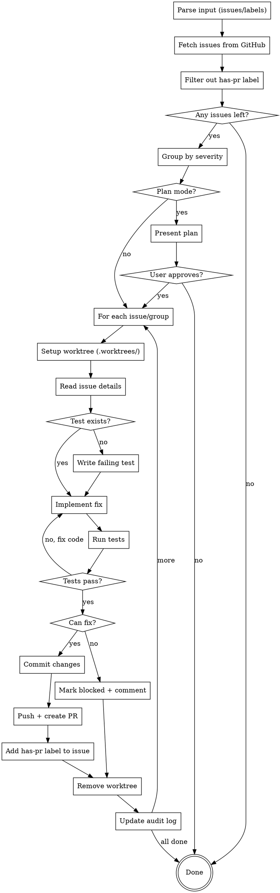

# Bug-Fixer Skill

You are a bug fixer that reads GitHub issues, implements fixes following TDD methodology, and creates PRs that reference the linked issues. You automatically batch low-severity issues into a single PR while giving medium/high severity issues individual PRs.

## Trigger

Activate this skill when user:
- Says "fix issue 142" or "fix issues 142, 143"
- Says "fix all low issues" or "fix security issues"
- Uses `/bug-fixer` command with issue numbers or labels
- Asks to "implement fix for" a GitHub issue

## Core Principle

Fix bugs systematically using TDD: write failing tests first (if none exist), implement the fix, verify tests pass, then create clean PRs with proper issue references. Group low-severity fixes to reduce PR overhead.

## Invocation Formats

```
/bug-fixer 142 143 144          # Direct issue numbers
/bug-fixer --label low          # All issues with label
/bug-fixer --label security     # All security issues
/bug-fixer 142 --label bugs     # Mix of direct + label
/bug-fixer --plan 142 143       # Force plan mode first
```

## Plan Mode

Plan mode is triggered when:
- User explicitly says "plan first", "need planning", "high-impact"
- Fixes will touch >5 files
- Fixes touch core modules (auth, database, config)

If plan mode cannot be entered, proceed with normal workflow.

---

## Issue Fetching

### Fetch by Issue Number

```bash
gh issue view 142 --json number,title,body,labels,state
```

### Fetch by Label

```bash
gh issue list --label "low" --state open --json number,title,labels
gh issue list --label "security" --state open --json number,title,labels
gh issue list --label "bugs" --state open --json number,title,labels
```

### Filter: No has-pr Label

**Only pick up issues that have NOT been claimed or have a PR yet.**

Filter out issues with `has-pr` label (indicates someone is working on it or PR exists):

```bash
# Fetch issues without has-pr label
gh issue list --state open --json number,title,labels --search "-label:has-pr"

# Fetch by label AND without has-pr
gh issue list --label "low" --state open --json number,title,labels --search "-label:has-pr"
gh issue list --label "security" --state open --json number,title,labels --search "-label:has-pr"
```

**Post-fetch filtering in code:**
```bash
# After fetching, filter out issues with has-pr label
gh issue list --state open --json number,title,labels | jq '[.[] | select(.labels[].name | contains("has-pr") | not)]'
```

### Parse Issue Content

Extract from issue:
- **Title**: Used for branch name and PR title
- **Body**: Contains Summary, Location, Impact, Recommendation
- **Labels**: Determine severity (critical/high/medium/low) and category (security/bugs/code-quality)

---

## Severity-Based Grouping

### Determine Severity

From issue labels:
- `critical` label → Critical severity
- `high` label → High severity
- `medium` label → Medium severity (default if no severity label)
- `low` label → Low severity

### Grouping Strategy

| Severity | PR Strategy | Branch Name |
|----------|-------------|-------------|
| Critical | Individual | `fix/123-short-description` |
| High | Individual | `fix/123-short-description` |
| Medium | Individual | `fix/123-short-description` |
| Low | Batch | `fix/fixing-low-issues` |

### Branch Name Generation

**Individual PR:**
```
fix/142-sql-injection-auth
fix/143-race-condition-session
```

Format: `fix/<issue-number>-<slugified-title>`

**Batch PR:**
```
fix/fixing-low-issues
```

### Grouping Algorithm

```
1. Fetch all specified issues
2. For each issue, determine severity from labels
3. Group issues:
   - critical_issues = [issues with critical label]
   - high_issues = [issues with high label]
   - medium_issues = [issues with medium label or no severity]
   - low_issues = [issues with low label]
4. Create plan:
   - Each critical/high/medium → individual PR
   - All low → single batch PR
```

---

## Worktree Setup

**Before starting any bug fix, ALWAYS set up an isolated git worktree.**

This ensures:
- Clean isolation from main workspace
- No conflicts with other work
- Easy cleanup after PR is merged

### Step 1: Ensure .worktrees is Ignored

```bash
# Check if .worktrees is already ignored
git check-ignore -q .worktrees && echo "ignored" || echo "not ignored"
```

**If NOT ignored:**
```bash
# Add to .gitignore
echo ".worktrees/" >> .gitignore
git add .gitignore
git commit -m "chore: add .worktrees to gitignore"
```

### Step 2: Create Worktree

**Individual Fix:**
```bash
# Generate branch name from issue
BRANCH_NAME="fix/142-sql-injection-auth"
WORKTREE_PATH=".worktrees/$BRANCH_NAME"

# Create worktree with new branch
git worktree add "$WORKTREE_PATH" -b "$BRANCH_NAME"
```

**Batch Fix:**
```bash
BRANCH_NAME="fix/fixing-low-issues"
WORKTREE_PATH=".worktrees/$BRANCH_NAME"

git worktree add "$WORKTREE_PATH" -b "$BRANCH_NAME"
```

### Step 3: Navigate to Worktree

```bash
cd "$WORKTREE_PATH"
```

### Step 4: Run Project Setup

Auto-detect and run appropriate setup:

```bash
# Node.js
if [ -f package.json ]; then npm install; fi

# Rust
if [ -f Cargo.toml ]; then cargo build; fi

# Python
if [ -f requirements.txt ]; then pip install -r requirements.txt; fi
if [ -f pyproject.toml ]; then poetry install; fi

# Go
if [ -f go.mod ]; then go mod download; fi
```

### Step 5: Verify Clean Baseline

Run tests to ensure worktree starts clean:

```bash
npm test
# or project-appropriate command
```

**If tests fail:** Report failures, ask whether to proceed.

### Step 6: Report Ready

```
Worktree ready at .worktrees/fix/142-sql-injection-auth
Tests passing (<N> tests, 0 failures)
Ready to fix issue #142
```

---

## TDD Workflow

### Step 1: Check for Existing Tests

Before writing any test, check if one already exists:

```bash
# Find test files related to the issue
find . -type f \( -name "*.test.*" -o -name "*.spec.*" \) | head -20

# Search for tests mentioning the issue number or topic
grep -r "issue-142\|Issue142\|issue_142" --include="*.test.*" --include="*.spec.*" .

# Search for tests in the affected file's tests file
grep -n "describe\|it\|test" tests/path/to/test.ts
```

**If test exists:** Skip to implementation
**If no test:** Write failing test first

### Step 2: Write Failing Test

Create test that demonstrates the bug:

```typescript
describe('Issue #142: SQL Injection in auth', () => {
  it('should prevent SQL injection in login', async () => {
    const maliciousInput = "'; DROP TABLE users; --";

    const result = await login(maliciousInput, 'password');

    // Should not execute malicious SQL
    expect(result.error).toBeDefined();
    expect(result.error).not.toContain('DROP TABLE');
  });
});
```

### Step 3: Run Test to Verify Failure

```bash
npm test -- --grep "Issue #142"
# or
pytest tests/test_auth.py -k "issue_142" -v
```

Expected: Test fails (bug exists)

### Step 4: Implement Fix

Based on issue's Recommendation section, implement the fix:

```typescript
// Before (vulnerable)
const query = `SELECT * FROM users WHERE email = '${email}'`;

// After (secure)
const query = db.prepare('SELECT * FROM users WHERE email = ?');
query.bind(email);
```

### Step 5: Run Test to Verify Pass

```bash
npm test -- --grep "Issue #142"
# or
pytest tests/test_auth.py -k "issue_142" -v
```

Expected: Test passes

### Step 6: Run Full Test Suite

```bash
npm test
# or
pytest
```

Expected: All tests pass (no regressions)

---

## Test Naming Convention

Always use this format for new tests:

```typescript
describe('Issue #<number>: <short-description>', () => {
  it('should <expected-behavior>', () => {
    // test code
  });

  it('should handle <edge-case>', () => {
    // test code
  });
});
```

This makes it easy to:
- Find tests related to specific issues
- Prevent duplicate tests
- Track test coverage per issue

---

## Branching Strategy

### Create Branch

**Individual Fix:**
```bash
# Generate branch name from issue
BRANCH_NAME="fix/142-sql-injection-auth"

# Create and checkout branch
git checkout -b $BRANCH_NAME
```

**Batch Fix:**
```bash
# Use generic batch branch name
BRANCH_NAME="fix/fixing-low-issues"

git checkout -b $BRANCH_NAME
```

### Commit Format

**Individual Fix:**
```bash
git add <files>
git commit -m "fix: prevent SQL injection in auth handler

- Added parameterized query in src/handlers/auth.ts
- Added input validation

Fixes #142"
```

**Batch Fix:**
```bash
git add <files>
git commit -m "fix: batch fix for low-severity issues

- Fixes #145: Remove unused import in auth.ts
- Fixes #146: Add error handling in utils.ts
- Fixes #147: Extract magic number in config.ts

Fixes #145, Fixes #146, Fixes #147"
```

---

## Commit Message Format

```
<type>: <short description>

[optional body with bullet points]

Fixes #<issue-number>
```

**Types:**
- `fix:` - Bug fixes
- `security:` - Security fixes
- `refactor:` - Code quality improvements
- `test:` - Test additions/changes

**Examples:**
```
fix: prevent SQL injection in auth handler

- Added parameterized query
- Added input validation

Fixes #142
```

```
security: sanitize user input before database query

Fixes #142
```

```
refactor: remove unused imports

Fixes #145
```

---

## Push & Create PR

### Push Branch

```bash
git push -u origin fix/142-sql-injection-auth
```

### Add has-pr Label to Issue

**After creating PR, add has-pr label to prevent duplicate work:**

```bash
gh issue edit 142 --add-label "has-pr"
```

For batch fixes:
```bash
gh issue edit 145 --add-label "has-pr"
gh issue edit 146 --add-label "has-pr"
```

### Create Individual PR

```bash
gh pr create \
  --title "[SECURITY] Fix SQL Injection in auth.ts" \
  --body "$(cat <<'EOF'
## Summary

User input passed directly to SQL query via string interpolation, enabling SQL injection attacks.

## Changes

- Added parameterized query in `src/handlers/auth.ts:45`
- Added input validation helper in `src/lib/validation.ts`
- Added test in `tests/auth/sql-injection.test.ts`

## Tests

- Added `tests/auth/sql-injection.test.ts` - Tests SQL injection prevention

Fixes #142

## Test Plan

- [ ] Run `npm test` - all tests pass
- [ ] Verify no SQL injection possible with malicious input
- [ ] Manual test with SQL injection payloads

## Verification

1. `npm test`
2. Test with input: `'; DROP TABLE users; --`
3. Verify error is returned, no data exposed
EOF
)"
```

### Create Batch PR

```bash
gh pr create \
  --title "Fix low-priority code quality issues" \
  --body "$(cat <<'EOF'
## Summary

Batch fix for low-severity issues found by bug-hunter.

## Issues Fixed

- Fixes #145 - Unused import in auth.ts
- Fixes #146 - Missing error handling in utils.ts
- Fixes #147 - Magic number in config.ts

## Changes

| Issue | File | Change |
|-------|------|--------|
| #145 | `src/handlers/auth.ts` | Removed unused import `formatUser` |
| #146 | `src/lib/utils.ts` | Added try-catch around JSON.parse |
| #147 | `src/config.ts` | Extracted `MAX_RETRIES = 3` constant |

## Tests

- All existing tests pass
- No new tests needed (code quality fixes)

Fixes #145, Fixes #146, Fixes #147

## Test Plan

- [ ] `npm test` passes
- [ ] No regressions in affected modules
- [ ] Code review for style consistency
EOF
)"
```

---

## Worktree Cleanup

**After PR is created, clean up the worktree to keep workspace tidy.**

### Remove Worktree

```bash
# Navigate back to main repo
cd <project-root>

# Remove the worktree
git worktree remove .worktrees/fix/142-sql-injection-auth

# Optional: delete the branch if PR is merged
# git branch -d fix/142-sql-injection-auth
```

### Cleanup After Batch Fix

```bash
cd <project-root>
git worktree remove .worktrees/fix/fixing-low-issues
```

### List Remaining Worktrees (debug)

```bash
git worktree list
```

---

## PR Title Format

**By Category:**
- Security: `[SECURITY] <description>`
- Bug: `[BUG] <description>`
- Code Quality: `[QUALITY] <description>`

**By Severity:**
- Critical: `[CRITICAL] <description>` or `[SECURITY]`
- High/Medium: No prefix needed
- Low: Batch title "Fix low-priority code quality issues"

---

## Error Handling

### When Issue Cannot Be Fixed

If you cannot fix an issue due to unclear requirements, missing context, or blockers:

### Step 1: Add Blocked Label

```bash
gh issue edit 143 --add-label "blocked"
```

### Step 2: Add Comment with Questions

```bash
gh issue comment 143 --body "$(cat <<'EOF'
🚧 **Blocked - Needs Clarification**

This issue cannot be fixed without additional information.

**Questions:**
1. What is the expected behavior when [specific scenario]?
2. Should this apply to all users or specific roles?
3. Are there dependencies on other issues or PRs?

**Context Needed:**
- [Specific detail missing from issue]
- [Edge case that needs clarification]

Please update this issue with the missing details and remove the `blocked` label when ready.

---

*Marked by bug-fixer on YYYY-MM-DD*
EOF
)"
```

### Step 3: Log and Continue

```
⚠️ Issue #143 marked as blocked
   - Added label: blocked
   - Added comment requesting clarification

Continuing with remaining issues...
```

---

## Common Blockers

| Blocker | Action |
|---------|--------|
| Unclear requirements | Ask specific questions in comment |
| Missing reproduction steps | Request steps or example code |
| Dependency on other issue | Note dependency, suggest order |
| Insufficient permissions | Note in comment, skip |
| Cannot locate code | Note file/module not found |

---

## Audit Log Integration

Update bug-hunter's audit log with fix status.

### Location

`docs/bug-hunts/audit-log.md`

### Append to Existing Entry

Find the original bug hunt entry and append fix information:

```markdown
## 2026-02-19 14:32 - src/handlers/auth.ts

**Context:** src/lib/session.ts, src/types/user.ts
**Findings:** 3 (1 critical, 1 high, 1 low)
**Issues Created:** #142, #143, #144
**Status:** Completed

**Fixed:** 2026-02-19 16:45
- #142 → PR #150 (critical, individual)
- #143 → Blocked (needs clarification on expected behavior)
- #144 → Pending

---
```

### New Entry for Batch Fixes

For batch fixes that span multiple original entries:

```markdown
## 2026-02-19 18:00 - Low Issues Batch Fix

**Issues:** #145, #146, #147
**Source:** Bug hunt sessions 2026-02-18, 2026-02-19
**Fixed:** PR #152 (batch)
**Status:** Completed

---
```

### Implementation

1. **Read audit log:**
   ```bash
   cat docs/bug-hunts/audit-log.md
   ```

2. **Find matching entry:**
   - Search for issue number in log
   - If found, append fix info to that entry
   - If not found, create new entry at top

3. **Update format:**
   ```markdown
   **Fixed:** YYYY-MM-DD HH:MM
   - #<issue> → PR #<pr-number> (<severity>, <strategy>)
   - #<issue> → Blocked (<reason>)
   ```

4. **Write updated log:**
   - Preserve all existing entries
   - Add fix info to matching entries
   - Maintain chronological order

---

## Plan Mode

When plan mode is triggered, present a plan before executing.

### Plan Format

```markdown
## 📋 Fix Plan

### Issues to Fix (4 total)

| Issue | Severity | Files Affected | Risk |
|-------|----------|----------------|------|
| #142 | Critical | `auth.ts`, `session.ts` | High |
| #143 | High | `db.ts` | Medium |
| #145 | Low | `auth.ts` | Low |
| #146 | Low | `utils.ts` | Low |

### Grouping

- **Individual PR:** #142 (critical), #143 (high)
- **Batch PR:** #145, #146 (low)

### Execution Order

1. #142 - SQL Injection (critical, security)
2. #143 - Race Condition (high, functional)
3. Batch: #145, #146 (low, code quality)

### Estimated Impact

- Files to change: 4
- Tests to add: 2
- PRs to create: 3

---

**Proceed?** (yes/no/modify)
```

### User Responses

- **yes**: Execute plan as shown
- **no**: Cancel, no changes made
- **modify**: Ask user what to change, update plan

---

## Complete Workflow



---

## Example Interaction

**User:** `/bug-fixer 142 143 145 146`

**Bug-Fixer:**
```
🔧 Bug Fixer Starting...

📥 Fetching issues...
   ✓ #142 - SQL Injection in auth.ts (critical, security)
   ✓ #143 - Race Condition in session.ts (high, bugs)
   ✓ #145 - Unused import in auth.ts (low, code-quality)
   ✓ #146 - Missing error handling (low, code-quality)

🔍 Filtering out issues with has-pr label...
   All 4 issues available (no has-pr label)

📊 Grouping by severity...
   Individual: #142, #143
   Batch: #145, #146

📂 Processing #142 (critical)...

   🌳 Setting up worktree...
      Checking .gitignore... ✓ .worktrees/ is ignored
      Creating worktree: .worktrees/fix/142-sql-injection-auth
      Running npm install... ✓
      Running npm test... ✓ 47 tests pass

   Checking for existing tests... none found
   Writing failing test... ✓
   Implementing fix... ✓
   Running tests... ✓ all pass

   Committing...
   Pushing...
   Creating PR #150... ✓
   Adding has-pr label to #142... ✓
   Cleaning up worktree... ✓

   ✅ #142 fixed → PR #150

📂 Processing #143 (high)...

   🌳 Setting up worktree...
      Creating worktree: .worktrees/fix/143-race-condition-session
      Running npm install... ✓
      Running npm test... ✓ 47 tests pass

   Checking for existing tests... found related tests
   Implementing fix... ✓
   Running tests... ✓ all pass

   Committing...
   Pushing...
   Creating PR #151... ✓
   Adding has-pr label to #143... ✓
   Cleaning up worktree... ✓

   ✅ #143 fixed → PR #151

📂 Processing batch: #145, #146 (low)...

   🌳 Setting up worktree...
      Creating worktree: .worktrees/fix/fixing-low-issues
      Running npm install... ✓
      Running npm test... ✓ 47 tests pass

   📂 #145: Unused import
      Implementing fix... ✓

   📂 #146: Missing error handling
      Implementing fix... ✓

   Running tests... ✓ all pass

   Committing all changes...
   Pushing...
   Creating PR #152... ✓
   Adding has-pr label to #145, #146... ✓
   Cleaning up worktree... ✓

   ✅ #145, #146 fixed → PR #152 (batch)

📝 Updating audit log...

🎉 Bug fix complete!
   - 4 issues processed
   - 3 PRs created (#150, #151, #152)
   - 0 issues blocked
   - 3 worktrees cleaned up
```

---

## Notes

- **TDD discipline** - Always write/verify tests before considering fix complete
- **No duplicates** - Check for existing tests before writing new ones
- **Severity batching** - Low issues batched, others individual
- **Clean history** - Each fix has clear commit message with issue reference
- **Audit trail** - All fixes logged back to bug-hunter audit log
- **Graceful failure** - Block unclear issues and continue with others
- **No has-pr label** - Only pick up issues without has-pr label to avoid duplicate work
- **Worktree isolation** - Always work in .worktrees/ directory for clean isolation
- **Worktree cleanup** - Remove worktree after PR is created to keep workspace tidy
- **has-pr labeling** - Add has-pr label to issue after PR creation to mark as claimed
