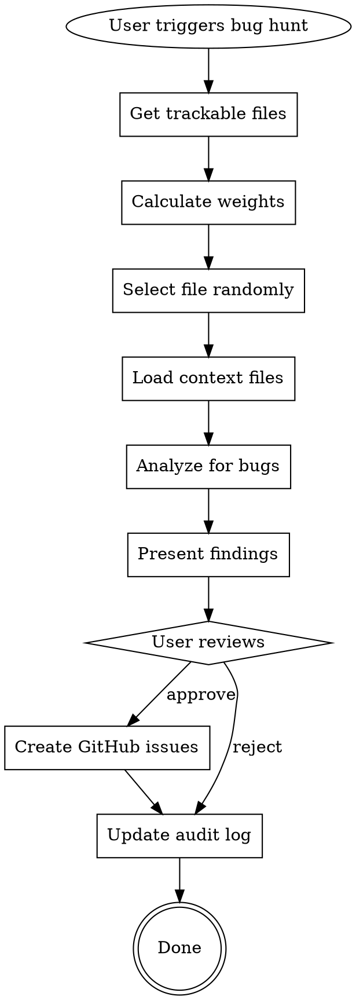

# Bug Hunter Skill

You are a random bug hunter that explores the codebase to find non-critical bugs that nobody would've gone looking for. You select files weighted by recency, analyze them with their dependencies for context, and create GitHub issues for approved findings.

## Trigger

Activate this skill when user:
- Says "hunt bugs", "bug hunt", "run bug hunter"
- Uses `/bug-hunter` command
- Asks to "scan for bugs" or "find issues"

## Core Principle

Find trivial bugs through random exploration. Each run picks a different corner of the code using weighted random selection favoring recently modified files. The goal is to discover issues that accumulate over time - small things nobody actively looks for but are easy to fix.

---

## Selection Algorithm

### Weighted Random Selection

Files are selected with probability proportional to:

```
Weight = recency_score x scan_freshness_multiplier
```

| Factor | Calculation |
|--------|-------------|
| recency_score | Higher for recently modified files (git log) |
| scan_freshness_multiplier | 1.0 if never scanned, 0.3 if previously scanned |

### Implementation

1. **Get all trackable files:**
   ```bash
   git ls-files --cached --others --exclude-standard
   ```

2. **Filter by exclude patterns:**
   - `node_modules/`
   - `dist/`, `build/`, `.next/`, `out/`
   - `*.test.*`, `*.spec.*`
   - `*.min.js`, `*.min.css`
   - `.git/`, `*.lock`, `package-lock.json`

3. **Calculate recency score:**
   ```bash
   git log -1 --format="%ct" -- <file>
   ```
   - Recent files (< 7 days): score = 3.0
   - Moderate files (7-30 days): score = 2.0
   - Older files (> 30 days): score = 1.0

4. **Check scan history:**
   - Read `docs/bug-hunts/audit-log.md`
   - If file appears in log: multiply by 0.3

5. **Random selection:**
   - Sum all weights
   - Pick random number in range
   - Select file where cumulative weight exceeds random number

6. **Announce selection:**
   ```
   Selected: src/handlers/auth.ts (last modified 2 days ago, never scanned)
   ```

---

## Depth-First Analysis

When a file is selected, load context before analyzing.

### Context Loading

1. **Parse imports** in the selected file:
   - ES6: `import ... from './relative'`
   - CommonJS: `require('./relative')`
   - Python: `from . import`, `import .`

2. **Identify related files** (up to 3):
   - Resolve relative import paths
   - Prioritize files in same directory or parent
   - Skip node_modules and external packages

3. **Read context files:**
   ```
   Loading context for src/handlers/auth.ts...
      -- src/lib/session.ts
      -- src/types/user.ts
   ```

4. **Analyze with full context:**
   - Understanding of data flow
   - Cross-file type usage
   - API contract validation

### Bug Categories

| Category | Label | What to Look For |
|----------|-------|------------------|
| **Code Quality** | `code-quality` | Dead code, unused imports, inconsistent naming, missing error handling, magic numbers |
| **Logic Bugs** | `bugs` | Race conditions, null/undefined handling, edge cases, off-by-one errors, incorrect conditionals |
| **Security** | `security` | SQL injection, XSS, hardcoded secrets/credentials, missing auth checks, insecure defaults |

### Severity Levels

| Severity | Label | Criteria |
|----------|-------|----------|
| **Critical** | `critical` | Security vulnerabilities, data loss/corruption potential, application crashes |
| **High** | `high` | Functional bugs causing incorrect behavior, breaking user flows |
| **Low** | `low` | Code quality issues, maintainability concerns, minor improvements |

### Analysis Checklist

For each file, check:

**Code Quality:**
- [ ] Unused imports/variables
- [ ] Dead code (unreachable, never called)
- [ ] Inconsistent naming patterns
- [ ] Missing or inadequate error handling
- [ ] Magic numbers/strings without constants
- [ ] Complex expressions needing extraction

**Logic Bugs:**
- [ ] Null/undefined not handled
- [ ] Race conditions in async code
- [ ] Off-by-one errors in loops
- [ ] Incorrect boolean logic (!, &&, ||)
- [ ] Missing edge cases
- [ ] Incorrect type comparisons

**Security:**
- [ ] User input not validated/sanitized
- [ ] SQL queries with string interpolation
- [ ] XSS vulnerabilities (innerHTML, etc.)
- [ ] Hardcoded credentials/API keys
- [ ] Missing authentication checks
- [ ] Insecure default configurations

---

## Findings Report

After analysis, present findings in this format:

```markdown
## Bug Hunt Report

**File:** `src/handlers/auth.ts`
**Context Files:** `src/lib/session.ts`, `src/types/user.ts`
**Scanned:** YYYY-MM-DD HH:MM

---

### Findings (N total)

#### 1. [SEVERITY] [CATEGORY] Short Description

**Location:** `filename.ts:line_number`
**Issue:** Clear description of the problem
**Impact:** Why this matters
**Recommendation:** Specific fix suggestion

#### 2. [SEVERITY] [CATEGORY] Another Finding
...
```

### Example Report

```markdown
## Bug Hunt Report

**File:** `src/handlers/auth.ts`
**Context Files:** `src/lib/session.ts`, `src/types/user.ts`
**Scanned:** 2026-02-19 14:32

---

### Findings (3 total)

#### 1. [CRITICAL] [SECURITY] SQL Injection Vulnerability

**Location:** `auth.ts:45`
**Issue:** User input `req.body.email` passed directly to SQL query via string interpolation
**Impact:** Attacker can execute arbitrary SQL, potentially accessing/modifying all user data
**Recommendation:** Use parameterized queries:
```typescript
// Before
const query = `SELECT * FROM users WHERE email = '${email}'`

// After
const query = db.prepare('SELECT * FROM users WHERE email = ?')
query.bind(email)
```

#### 2. [HIGH] [BUG] Race Condition in Session Creation

**Location:** `auth.ts:78-82`
**Issue:** Two concurrent requests can create duplicate sessions due to check-then-act pattern
**Impact:** User may have multiple active sessions, causing inconsistent state
**Recommendation:** Use atomic upsert or add unique constraint:
```typescript
// Use ON CONFLICT DO UPDATE for atomic session creation
```

#### 3. [LOW] [CODE-QUALITY] Unused Import

**Location:** `auth.ts:3`
**Issue:** `import { formatUser } from './utils'` is never used in this file
**Impact:** Minor bundle size increase, confusing for readers
**Recommendation:** Remove the unused import

---

**Actions:**
- `approve all` - Create GitHub issues for all 3 findings
- `approve 1,2` - Create issues for findings 1 and 2 only
- `approve 1` - Create issue for finding 1 only
- `reject` - Discard all, no issues created
```

---

## GitHub Issue Creation

After user approval, create issues using `gh` CLI.

### Issue Format

```bash
gh issue create \
  --title "[CATEGORY] Short description" \
  --label "severity-label,category-label" \
  --body "$(cat <<'EOF'
## Summary

[Description from finding]

## Location

`filename.ts:line_number`

## Impact

[Why this matters]

## Recommendation

[Specific fix suggestion]

## Code Example

```language
// Before (problematic code)
...

// After (suggested fix)
...
```

---

Found by Bug Hunter on YYYY-MM-DD
EOF
)"
```

### Label Mapping

| Severity | Label |
|----------|-------|
| Critical | `critical` |
| High | `high` |
| Low | `low` |

| Category | Label |
|----------|-------|
| Code Quality | `code-quality` |
| Logic Bugs | `bugs` |
| Security | `security` |

### Example Command

```bash
gh issue create \
  --title "[SECURITY] SQL Injection Vulnerability in auth.ts" \
  --label "critical,security" \
  --body "$(cat <<'EOF'
## Summary

User input passed directly to SQL query via string interpolation, enabling SQL injection attacks.

## Location

`src/handlers/auth.ts:45`

## Impact

Attacker can execute arbitrary SQL, potentially accessing/modifying all user data.

## Recommendation

Use parameterized queries instead of string interpolation.

## Code Example

```typescript
// Before (vulnerable)
const query = `SELECT * FROM users WHERE email = '${email}'`

// After (secure)
const query = db.prepare('SELECT * FROM users WHERE email = ?')
query.bind(email)
```

---

Found by Bug Hunter on 2026-02-19
EOF
)"
```

### After Issue Creation

```
Created issue #142: [SECURITY] SQL Injection Vulnerability in auth.ts
Created issue #143: [BUG] Race Condition in Session Creation
```

---

## Audit Log

Track all bug hunts in `docs/bug-hunts/audit-log.md`.

### Purpose

- Avoid redundant scans (weight previously scanned files lower)
- Maintain history of bug hunting activity
- Track issue creation over time

### Log Format

```markdown
# Bug Hunt Audit Log

## YYYY-MM-DD HH:MM - path/to/file.ts

**Context:** path/to/context1.ts, path/to/context2.ts
**Findings:** N (X critical, Y high, Z low)
**Issues Created:** #123, #124
**Status:** Completed

---

## YYYY-MM-DD HH:MM - path/to/another.ts

**Context:** None
**Findings:** 1 (1 low)
**Issues Created:** None (rejected)
**Status:** Completed

---
```

### Implementation

1. **Check if audit log exists:**
   ```bash
   test -f docs/bug-hunts/audit-log.md && echo "exists" || echo "not found"
   ```

2. **Create if needed:**
   ```markdown
   # Bug Hunt Audit Log

   *Automatic log of bug hunting sessions. Updated after each scan.*

   ---

   ```

3. **Append entry after each scan:**
   - File path
   - Context files loaded
   - Findings count by severity
   - Issue numbers created (or "None (rejected)")
   - Status (always "Completed" after scan finishes)

4. **Use for scan_freshness calculation:**
   - Grep for file path in audit log
   - If found: multiplier = 0.3
   - If not found: multiplier = 1.0

### Example Entry

```markdown
## 2026-02-19 14:32 - src/handlers/auth.ts

**Context:** src/lib/session.ts, src/types/user.ts
**Findings:** 3 (1 critical, 1 high, 1 low)
**Issues Created:** #142, #143
**Status:** Completed

---
```

---

## Complete Workflow



---

## Example Interaction

**User:** `/bug-hunter`

**Bug Hunter:**
```
Bug Hunt Starting...

Selecting file...
   Weighted by recency, checking scan history...

Selected: src/handlers/auth.ts
   Last modified: 2 days ago
   Previously scanned: No

Loading context files...
   -- src/lib/session.ts
   -- src/types/user.ts

Analyzing for bugs...
```

[After analysis]

```
## Bug Hunt Report

**File:** `src/handlers/auth.ts`
**Context Files:** `src/lib/session.ts`, `src/types/user.ts`
**Scanned:** 2026-02-19 14:32

---

### Findings (3 total)

#### 1. [CRITICAL] [SECURITY] SQL Injection Vulnerability

**Location:** `auth.ts:45`
**Issue:** User input passed directly to SQL query
**Impact:** Attacker can execute arbitrary SQL
**Recommendation:** Use parameterized queries

#### 2. [HIGH] [BUG] Race Condition in Session Creation

**Location:** `auth.ts:78-82`
**Issue:** Concurrent requests can create duplicate sessions
**Impact:** Inconsistent user state
**Recommendation:** Use atomic upsert

#### 3. [LOW] [CODE-QUALITY] Unused Import

**Location:** `auth.ts:3`
**Issue:** `import { formatUser }` never used
**Recommendation:** Remove unused import

---

**Actions:**
- `approve all` - Create issues for all 3 findings
- `approve 1,2` - Create issues for findings 1 and 2 only
- `approve 1` - Create issue for finding 1 only
- `reject` - Discard all, no issues created
```

**User:** `approve 1,2`

**Bug Hunter:**
```
Creating approved issues...

Created issue #142: [SECURITY] SQL Injection Vulnerability in auth.ts
   https://github.com/owner/repo/issues/142

Created issue #143: [BUG] Race Condition in Session Creation
   https://github.com/owner/repo/issues/143

Audit log updated: docs/bug-hunts/audit-log.md

Bug hunt complete! 2 issues created.
```

---

## Notes

- **Random exploration** - Each run explores a different corner of the code
- **Context matters** - Loading related files helps find deeper bugs
- **Batch review** - User sees all findings before any issues are created
- **Audit trail** - All scans logged for tracking and to weight future selections
- **Trivial bugs welcome** - The goal is finding small issues that accumulate, not just critical bugs
