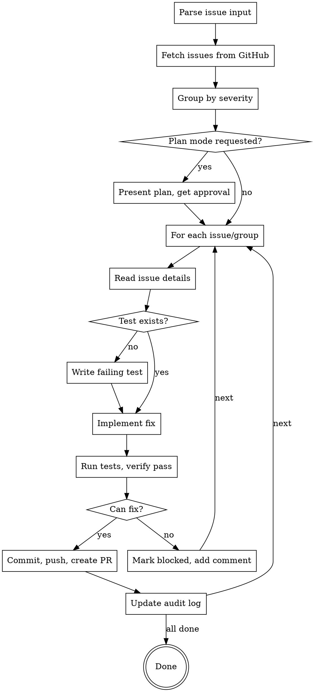

# Bug-Fixer Plugin Design

**Date:** 2026-02-19
**Status:** Approved

---

## Overview

A Claude Code skill that reads GitHub issues, implements fixes following TDD, and creates PRs that reference the linked issues. Automatically batches low-severity issues into a single PR, while medium/high severity issues get individual PRs.

---

## Trigger & Input

### Invocation Methods

```
/bug-fixer 142 143 144          # Direct issue numbers
/bug-fixer --label low          # All issues with label
/bug-fixer --label security     # All security issues
/bug-fixer 142 --label bugs     # Mix of direct + label
```

### Plan Mode Trigger

- User explicitly says "plan first" or "need planning"
- User mentions "high-impact" or "critical module"
- Skill suggests plan mode if fixes touch >5 files or core modules
- If plan mode unavailable, proceed with normal workflow

---

## Workflow



---

## Severity-Based Batching

| Severity | PR Strategy | Branch Name Format |
|----------|-------------|-------------------|
| **Low** | Batch (all together) | `fix/fixing-low-issues` |
| **Medium** | Individual | `fix/123-short-description` |
| **High** | Individual | `fix/123-short-description` |
| **Critical** | Individual | `fix/123-short-description` |

---

## TDD with Duplicate Prevention

### Before Writing Tests

1. Search for existing test file:
   ```bash
   find . -name "*.test.*" -o -name "*.spec.*" | xargs grep -l "issue-123\|Issue123"
   ```

2. Check test file for related tests:
   ```bash
   grep -n "describe\|it\|test" tests/path/test.ts | grep -i "<bug-topic>"
   ```

3. **If test exists:** Skip to implementation
4. **If no test:** Write failing test first

### Test Naming Convention

```typescript
describe('Issue #123: <short-description>', () => {
  it('should <expected behavior>', () => {
    // test
  });
});
```

---

## Branch & PR Structure

### Individual PR

```
Branch: fix/142-sql-injection-auth

PR Title: [SECURITY] Fix SQL Injection in auth.ts

PR Body:
## Summary
User input passed directly to SQL query via string interpolation...

## Changes
- Added parameterized query in `src/handlers/auth.ts:45`
- Added input validation helper

## Tests
- Added `tests/auth/sql-injection.test.ts`

Fixes #142

## Test Plan
- [ ] Run `npm test` - all tests pass
- [ ] Verify no SQL injection possible with malicious input

## Verification
1. `npm test`
2. Manual test with SQL injection payload
```

### Batch PR (Low Issues)

```
Branch: fix/fixing-low-issues

PR Title: Fix low-priority code quality issues

PR Body:
## Summary
Batch fix for low-severity issues found by bug-hunter.

## Issues Fixed
- Fixes #145 - Unused import in auth.ts
- Fixes #146 - Missing error handling in utils.ts
- Fixes #147 - Magic number in config.ts

## Changes
| Issue | File | Change |
|-------|------|--------|
| #145 | `src/handlers/auth.ts` | Removed unused import |
| #146 | `src/lib/utils.ts` | Added try-catch |
| #147 | `src/config.ts` | Extracted constant |

Fixes #145, Fixes #146, Fixes #147

## Test Plan
- [ ] `npm test` passes
- [ ] No regressions in affected modules
```

---

## Error Handling (Blocked Issues)

When an issue cannot be fixed:

```bash
# Add blocked label
gh issue edit 143 --add-label "blocked"

# Add comment with clarification questions
gh issue comment 143 --body "$(cat <<'EOF'
🚧 **Blocked - Needs Clarification**

This issue cannot be fixed without additional information:

**Questions:**
1. What is the expected behavior when X happens?
2. Should this apply to all users or just admins?
3. Is there a dependency on issue #140?

Please update this issue with the missing details and remove the `blocked` label.

---
*Automatically marked by bug-fixer*
EOF
)"
```

---

## Audit Log Integration

### Append to Existing Bug-Hunt Entry

```markdown
## 2026-02-19 14:32 - src/handlers/auth.ts

**Context:** src/lib/session.ts, src/types/user.ts
**Findings:** 3 (1 critical, 1 high, 1 low)
**Issues Created:** #142, #143
**Status:** Completed

**Fixed:** 2026-02-19 16:45
- #142 → PR #150 (critical, individual)
- #143 → Blocked (needs clarification)

---
```

### New Entry for Batch Fixes

```markdown
## 2026-02-19 18:00 - Low Issues Batch

**Issues:** #145, #146, #147
**Fixed:** PR #152 (batch)
**Status:** Completed

---
```

---

## Plan Mode

### Triggers

- User says "plan first", "need planning", "high-impact"
- Fixes touch >5 files
- Fixes touch core/critical modules (config, auth, database)

### Plan Format

```markdown
## 📋 Fix Plan

### Issues to Fix (4 total)

| Issue | Severity | Files Affected | Risk |
|-------|----------|----------------|------|
| #142 | Critical | `auth.ts`, `session.ts` | High |
| #143 | High | `db.ts` | Medium |
| #145 | Low | `auth.ts` | Low |
| #146 | Low | `utils.ts` | Low |

### Grouping
- **Individual PR:** #142, #143
- **Batch PR:** #145, #146

### Order
1. #142 (critical, security)
2. #143 (high, functional)
3. Batch: #145, #146 (low, code quality)

### Estimated Impact
- 4 files changed
- 3 tests to add
- 3 PRs to create

---

**Proceed?** (yes/no/modify)
```

---

## Plugin Structure

```
bug-fixer/
├── .claude-plugin/
│   └── plugin.json
└── skills/
    └── bug-fixer/
        └── SKILL.md
```

---

## Configuration Summary

| Setting | Value |
|---------|-------|
| Issue input | Direct numbers + label-based |
| Batching | Low = batch, Medium/High/Critical = individual |
| Workflow | Full TDD with duplicate test prevention |
| Branch naming | Descriptive for individual, generic for batch |
| Audit log | Append to original bug-hunt entry |
| Error handling | Mark blocked + add comment with questions |
| PR format | Detailed with summary from issue |
| Plan mode | Optional, triggered by user or complexity |
