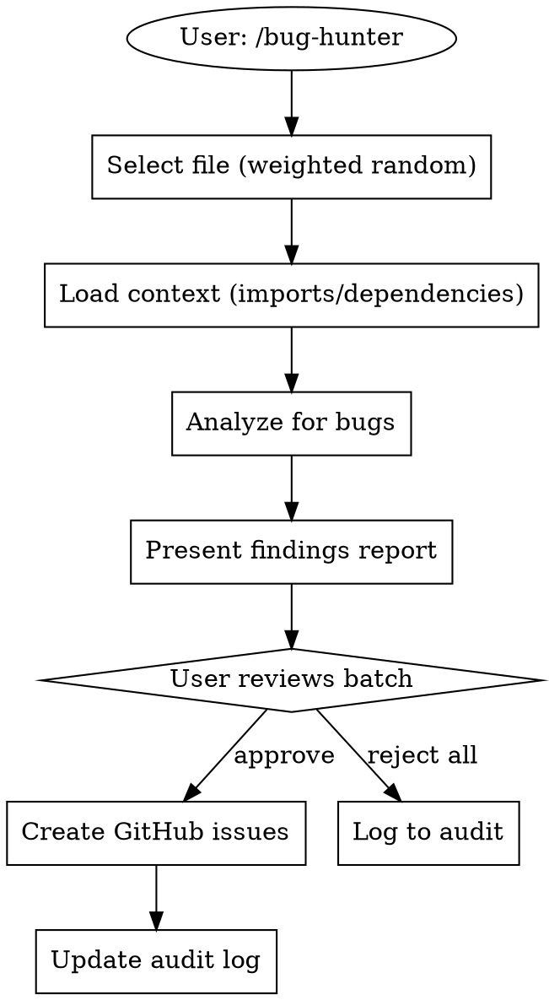

# Bug Hunter Plugin Design

**Date:** 2026-02-19
**Status:** Approved

---

## Overview

A Claude Code skill that performs random bug hunting on your codebase using depth-first analysis with context awareness. It selects files weighted by recency, analyzes them with their dependencies, and creates structured GitHub issues for approved findings.

---

## Selection Algorithm

```
Weight = recency_score * scan_freshness_multiplier

recency_score: Higher for recently modified files
scan_freshness_multiplier:
  - 1.0 for never scanned
  - 0.3 for previously scanned (lower weight, still possible)
```

### File Selection Process

1. Get all trackable files (respecting exclude patterns)
2. Calculate weighted score for each
3. Random selection with probability proportional to weight
4. Record selection in audit log

---

## Depth-First Analysis

When a file is selected:

```
selected_file.ts
    ├── Parse imports/requires
    ├── Identify related files
    │   ├── direct imports (up to 3)
    │   └── type definition files
    ├── Read all context files
    └── Analyze for bugs with full context
```

### Bug Categories

| Category | Label | Examples |
|----------|-------|----------|
| Code Quality | `code-quality` | Dead code, unused imports, inconsistent patterns |
| Logic Bugs | `bugs` | Race conditions, null handling, edge cases, incorrect conditionals |
| Security | `security` | SQL injection, XSS, hardcoded secrets, auth issues |

### Severity Levels

| Severity | Label | Criteria |
|----------|-------|----------|
| Critical | `critical` | Security vulnerabilities, data loss potential, crashes |
| High | `high` | Functional bugs, breaking behavior |
| Low | `low` | Code quality issues, minor improvements |

---

## Workflow



---

## Output Format

### Findings Report

```markdown
## 🐛 Bug Hunt Report

**File:** `src/handlers/auth.ts`
**Context Files:** `src/lib/session.ts`, `src/types/user.ts`
**Scanned:** 2026-02-19 14:32

---

### Findings (3 total)

#### 1. [CRITICAL] [SECURITY] Missing input validation
**Location:** `auth.ts:45`
**Issue:** User input passed directly to database query
**Recommendation:** Add parameterized query or input sanitization

#### 2. [HIGH] [BUG] Race condition in session handling
**Location:** `auth.ts:78-82`
**Issue:** Concurrent requests may create duplicate sessions
**Recommendation:** Add mutex or use atomic operations

#### 3. [LOW] [CODE-QUALITY] Unused import
**Location:** `auth.ts:3`
**Issue:** `import { unused } from 'lib'` never used
**Recommendation:** Remove unused import

---

**Actions:**
- `approve all` - Create issues for all findings
- `approve 1,2` - Create issues for specific findings
- `reject` - Discard all, no issues created
```

---

## Audit Log Structure

**File:** `docs/bug-hunts/audit-log.md`

```markdown
# Bug Hunt Audit Log

## 2026-02-19 14:32 - src/handlers/auth.ts

**Context:** src/lib/session.ts, src/types/user.ts
**Findings:** 3 (1 critical, 1 high, 1 low)
**Issues Created:** #142, #143
**Status:** Completed

---

## 2026-02-18 09:15 - src/utils/format.ts

**Context:** None
**Findings:** 1 (1 low)
**Issues Created:** None (rejected)
**Status:** Completed

---
```

---

## Plugin Structure

```
bug-hunter/
├── .claude-plugin/
│   └── plugin.json
└── skills/
    └── bug-hunter/
        └── SKILL.md
```

---

## Exclude Patterns

Default patterns to ignore:

- `node_modules/`
- `dist/`, `build/`, `.next/`
- `*.test.*`, `*.spec.*`
- `*.min.js`
- `.git/`

---

## Configuration Summary

| Setting | Value |
|---------|-------|
| Scope | All bug types (quality, logic, security) |
| Selection | Weighted by recency |
| Previously scanned | Weighted lower (0.3x) |
| Output | GitHub Issues |
| Severity levels | critical, high, low |
| Category labels | code-quality, bugs, security |
| Workflow | Batch review before create |
| Trigger | Manual only |
| Tracking | Markdown audit log |
