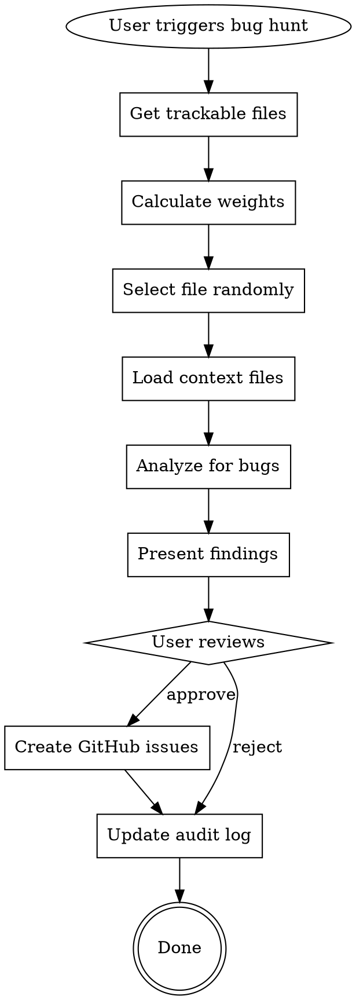

# Bug Hunter Plugin Implementation Plan

> **For Claude:** REQUIRED SUB-SKILL: Use superpowers:executing-plans to implement this plan task-by-task.

**Goal:** Create a bug-hunter skill that randomly selects files weighted by recency, analyzes them with context, and creates GitHub issues for approved findings.

**Architecture:** Claude Code skill (SKILL.md) that uses git commands for file selection weighting, Read tool for analysis, and gh CLI for issue creation. Tracks scans in a markdown audit log.

**Tech Stack:** Claude Code skill system, git, gh CLI, markdown

---

## Task 1: Create Plugin Directory Structure

**Files:**
- Create: `bug-hunter/.claude-plugin/plugin.json`
- Create: `bug-hunter/skills/bug-hunter/SKILL.md`

**Step 1: Create directory structure**

Run:
```bash
mkdir -p bug-hunter/.claude-plugin bug-hunter/skills/bug-hunter
```

Expected: Directories created successfully

**Step 2: Verify structure**

Run:
```bash
ls -la bug-hunter/
```

Expected:
```
drwxrwxr-x 2 satria satria 4096 Feb 19 14:00 .claude-plugin
drwxrwxr-x 3 satria satria 4096 Feb 19 14:00 skills
```

---

## Task 2: Create Plugin Metadata

**Files:**
- Create: `bug-hunter/.claude-plugin/plugin.json`

**Step 1: Create plugin.json**

```json
{
  "name": "bug-hunter",
  "description": "Random bug hunter that selects files weighted by recency, analyzes with context, and creates GitHub issues for approved findings",
  "author": {
    "name": "Satria Chandra",
    "email": "satriachandrayw@gmail.com"
  }
}
```

**Step 2: Verify file created**

Run:
```bash
cat bug-hunter/.claude-plugin/plugin.json
```

Expected: JSON content displayed correctly

**Step 3: Commit**

```bash
git add bug-hunter/.claude-plugin/plugin.json
git commit -m "feat(bug-hunter): add plugin metadata

Co-Authored-By: Claude Opus 4.6 <noreply@anthropic.com>"
```

---

## Task 3: Create Bug Hunter Skill - Part 1 (Header & Trigger)

**Files:**
- Create: `bug-hunter/skills/bug-hunter/SKILL.md`

**Step 1: Create SKILL.md with header and trigger section**

```markdown
---
name: bug-hunter
description: Random bug hunter that selects files weighted by recency, analyzes with context for bugs (code quality, logic, security), and creates GitHub issues. Use when user says "hunt bugs", "bug hunt", or "/bug-hunter".
version: 1.0.0
---

# Bug Hunter Skill

You are a random bug hunter that explores the codebase to find non-critical bugs that nobody would've gone looking for. You select files weighted by recency, analyze them with their dependencies for context, and create GitHub issues for approved findings.

## Trigger

Activate this skill when user:
- Says "hunt bugs", "bug hunt", "run bug hunter"
- Uses `/bug-hunter` command
- Asks to "scan for bugs" or "find issues"

## Core Principle

Find trivial bugs through random exploration. Each run picks a different corner of the code using weighted random selection favoring recently modified files. The goal is to discover issues that accumulate over time - small things nobody actively looks for but are easy to fix.
```

**Step 2: Verify file start**

Run:
```bash
head -30 bug-hunter/skills/bug-hunter/SKILL.md
```

Expected: Header and trigger section displayed

---

## Task 4: Create Bug Hunter Skill - Part 2 (Selection Algorithm)

**Files:**
- Modify: `bug-hunter/skills/bug-hunter/SKILL.md`

**Step 1: Append selection algorithm section**

Append to SKILL.md:

```markdown

---

## Selection Algorithm

### Weighted Random Selection

Files are selected with probability proportional to:

```
Weight = recency_score × scan_freshness_multiplier
```

| Factor | Calculation |
|--------|-------------|
| recency_score | Higher for recently modified files (git log) |
| scan_freshness_multiplier | 1.0 if never scanned, 0.3 if previously scanned |

### Implementation

1. **Get all trackable files:**
   ```bash
   git ls-files --cached --others --exclude-standard
   ```

2. **Filter by exclude patterns:**
   - `node_modules/`
   - `dist/`, `build/`, `.next/`, `out/`
   - `*.test.*`, `*.spec.*`
   - `*.min.js`, `*.min.css`
   - `.git/`, `*.lock`, `package-lock.json`

3. **Calculate recency score:**
   ```bash
   git log -1 --format="%ct" -- <file>
   ```
   - Recent files (< 7 days): score = 3.0
   - Moderate files (7-30 days): score = 2.0
   - Older files (> 30 days): score = 1.0

4. **Check scan history:**
   - Read `docs/bug-hunts/audit-log.md`
   - If file appears in log: multiply by 0.3

5. **Random selection:**
   - Sum all weights
   - Pick random number in range
   - Select file where cumulative weight exceeds random number

6. **Announce selection:**
   ```
   🎯 Selected: src/handlers/auth.ts (last modified 2 days ago, never scanned)
   ```
```

**Step 2: Verify section added**

Run:
```bash
grep -A5 "Selection Algorithm" bug-hunter/skills/bug-hunter/SKILL.md
```

Expected: Selection algorithm section content displayed

---

## Task 5: Create Bug Hunter Skill - Part 3 (Depth-First Analysis)

**Files:**
- Modify: `bug-hunter/skills/bug-hunter/SKILL.md`

**Step 1: Append depth-first analysis section**

Append to SKILL.md:

```markdown

---

## Depth-First Analysis

When a file is selected, load context before analyzing.

### Context Loading

1. **Parse imports** in the selected file:
   - ES6: `import ... from './relative'`
   - CommonJS: `require('./relative')`
   - Python: `from . import`, `import .`

2. **Identify related files** (up to 3):
   - Resolve relative import paths
   - Prioritize files in same directory or parent
   - Skip node_modules and external packages

3. **Read context files:**
   ```
   📂 Loading context for src/handlers/auth.ts...
      └── src/lib/session.ts
      └── src/types/user.ts
   ```

4. **Analyze with full context:**
   - Understanding of data flow
   - Cross-file type usage
   - API contract validation

### Bug Categories

| Category | Label | What to Look For |
|----------|-------|------------------|
| **Code Quality** | `code-quality` | Dead code, unused imports, inconsistent naming, missing error handling, magic numbers |
| **Logic Bugs** | `bugs` | Race conditions, null/undefined handling, edge cases, off-by-one errors, incorrect conditionals |
| **Security** | `security` | SQL injection, XSS, hardcoded secrets/credentials, missing auth checks, insecure defaults |

### Severity Levels

| Severity | Label | Criteria |
|----------|-------|----------|
| **Critical** | `critical` | Security vulnerabilities, data loss/corruption potential, application crashes |
| **High** | `high` | Functional bugs causing incorrect behavior, breaking user flows |
| **Low** | `low` | Code quality issues, maintainability concerns, minor improvements |

### Analysis Checklist

For each file, check:

**Code Quality:**
- [ ] Unused imports/variables
- [ ] Dead code (unreachable, never called)
- [ ] Inconsistent naming patterns
- [ ] Missing or inadequate error handling
- [ ] Magic numbers/strings without constants
- [ ] Complex expressions needing extraction

**Logic Bugs:**
- [ ] Null/undefined not handled
- [ ] Race conditions in async code
- [ ] Off-by-one errors in loops
- [ ] Incorrect boolean logic (!, &&, \|\|)
- [ ] Missing edge cases
- [ ] Incorrect type comparisons

**Security:**
- [ ] User input not validated/sanitized
- [ ] SQL queries with string interpolation
- [ ] XSS vulnerabilities (innerHTML, etc.)
- [ ] Hardcoded credentials/API keys
- [ ] Missing authentication checks
- [ ] Insecure default configurations
```

**Step 2: Verify section added**

Run:
```bash
grep -A5 "Depth-First Analysis" bug-hunter/skills/bug-hunter/SKILL.md
```

Expected: Depth-first analysis section content displayed

---

## Task 6: Create Bug Hunter Skill - Part 4 (Findings Report)

**Files:**
- Modify: `bug-hunter/skills/bug-hunter/SKILL.md`

**Step 1: Append findings report section**

Append to SKILL.md:

```markdown

---

## Findings Report

After analysis, present findings in this format:

```markdown
## 🐛 Bug Hunt Report

**File:** `src/handlers/auth.ts`
**Context Files:** `src/lib/session.ts`, `src/types/user.ts`
**Scanned:** YYYY-MM-DD HH:MM

---

### Findings (N total)

#### 1. [SEVERITY] [CATEGORY] Short Description

**Location:** `filename.ts:line_number`
**Issue:** Clear description of the problem
**Impact:** Why this matters
**Recommendation:** Specific fix suggestion

#### 2. [SEVERITY] [CATEGORY] Another Finding
...
```

### Example Report

```markdown
## 🐛 Bug Hunt Report

**File:** `src/handlers/auth.ts`
**Context Files:** `src/lib/session.ts`, `src/types/user.ts`
**Scanned:** 2026-02-19 14:32

---

### Findings (3 total)

#### 1. [CRITICAL] [SECURITY] SQL Injection Vulnerability

**Location:** `auth.ts:45`
**Issue:** User input `req.body.email` passed directly to SQL query via string interpolation
**Impact:** Attacker can execute arbitrary SQL, potentially accessing/modifying all user data
**Recommendation:** Use parameterized queries:
```typescript
// Before
const query = `SELECT * FROM users WHERE email = '${email}'`

// After
const query = db.prepare('SELECT * FROM users WHERE email = ?')
query.bind(email)
```

#### 2. [HIGH] [BUG] Race Condition in Session Creation

**Location:** `auth.ts:78-82`
**Issue:** Two concurrent requests can create duplicate sessions due to check-then-act pattern
**Impact:** User may have multiple active sessions, causing inconsistent state
**Recommendation:** Use atomic upsert or add unique constraint:
```typescript
// Use ON CONFLICT DO UPDATE for atomic session creation
```

#### 3. [LOW] [CODE-QUALITY] Unused Import

**Location:** `auth.ts:3`
**Issue:** `import { formatUser } from './utils'` is never used in this file
**Impact:** Minor bundle size increase, confusing for readers
**Recommendation:** Remove the unused import

---

**Actions:**
- `approve all` - Create GitHub issues for all 3 findings
- `approve 1,2` - Create issues for findings 1 and 2 only
- `approve 1` - Create issue for finding 1 only
- `reject` - Discard all, no issues created
```
```

**Step 2: Verify section added**

Run:
```bash
grep -A5 "Findings Report" bug-hunter/skills/bug-hunter/SKILL.md
```

Expected: Findings report section content displayed

---

## Task 7: Create Bug Hunter Skill - Part 5 (GitHub Issue Creation)

**Files:**
- Modify: `bug-hunter/skills/bug-hunter/SKILL.md`

**Step 1: Append GitHub issue creation section**

Append to SKILL.md:

```markdown

---

## GitHub Issue Creation

After user approval, create issues using `gh` CLI.

### Issue Format

```bash
gh issue create \
  --title "[CATEGORY] Short description" \
  --label "severity-label,category-label" \
  --body "$(cat <<'EOF'
## Summary

[Description from finding]

## Location

`filename.ts:line_number`

## Impact

[Why this matters]

## Recommendation

[Specific fix suggestion]

## Code Example

```language
// Before (problematic code)
...

// After (suggested fix)
...
```

---

🤖 Found by Bug Hunter on YYYY-MM-DD
EOF
)"
```

### Label Mapping

| Severity | Label |
|----------|-------|
| Critical | `critical` |
| High | `high` |
| Low | `low` |

| Category | Label |
|----------|-------|
| Code Quality | `code-quality` |
| Logic Bugs | `bugs` |
| Security | `security` |

### Example Command

```bash
gh issue create \
  --title "[SECURITY] SQL Injection Vulnerability in auth.ts" \
  --label "critical,security" \
  --body "$(cat <<'EOF'
## Summary

User input passed directly to SQL query via string interpolation, enabling SQL injection attacks.

## Location

`src/handlers/auth.ts:45`

## Impact

Attacker can execute arbitrary SQL, potentially accessing/modifying all user data.

## Recommendation

Use parameterized queries instead of string interpolation.

## Code Example

```typescript
// Before (vulnerable)
const query = `SELECT * FROM users WHERE email = '${email}'`

// After (secure)
const query = db.prepare('SELECT * FROM users WHERE email = ?')
query.bind(email)
```

---

🤖 Found by Bug Hunter on 2026-02-19
EOF
)"
```

### After Issue Creation

```
✅ Created issue #142: [SECURITY] SQL Injection Vulnerability in auth.ts
✅ Created issue #143: [BUG] Race Condition in Session Creation
```
```

**Step 2: Verify section added**

Run:
```bash
grep -A5 "GitHub Issue Creation" bug-hunter/skills/bug-hunter/SKILL.md
```

Expected: GitHub issue creation section content displayed

---

## Task 8: Create Bug Hunter Skill - Part 6 (Audit Log)

**Files:**
- Modify: `bug-hunter/skills/bug-hunter/SKILL.md`

**Step 1: Append audit log section**

Append to SKILL.md:

```markdown

---

## Audit Log

Track all bug hunts in `docs/bug-hunts/audit-log.md`.

### Purpose

- Avoid redundant scans (weight previously scanned files lower)
- Maintain history of bug hunting activity
- Track issue creation over time

### Log Format

```markdown
# Bug Hunt Audit Log

## YYYY-MM-DD HH:MM - path/to/file.ts

**Context:** path/to/context1.ts, path/to/context2.ts
**Findings:** N (X critical, Y high, Z low)
**Issues Created:** #123, #124
**Status:** Completed

---

## YYYY-MM-DD HH:MM - path/to/another.ts

**Context:** None
**Findings:** 1 (1 low)
**Issues Created:** None (rejected)
**Status:** Completed

---
```

### Implementation

1. **Check if audit log exists:**
   ```bash
   test -f docs/bug-hunts/audit-log.md && echo "exists" || echo "not found"
   ```

2. **Create if needed:**
   ```markdown
   # Bug Hunt Audit Log

   *Automatic log of bug hunting sessions. Updated after each scan.*

   ---

   ```

3. **Append entry after each scan:**
   - File path
   - Context files loaded
   - Findings count by severity
   - Issue numbers created (or "None (rejected)")
   - Status (always "Completed" after scan finishes)

4. **Use for scan_freshness calculation:**
   - Grep for file path in audit log
   - If found: multiplier = 0.3
   - If not found: multiplier = 1.0

### Example Entry

```markdown
## 2026-02-19 14:32 - src/handlers/auth.ts

**Context:** src/lib/session.ts, src/types/user.ts
**Findings:** 3 (1 critical, 1 high, 1 low)
**Issues Created:** #142, #143
**Status:** Completed

---
```
```

**Step 2: Verify section added**

Run:
```bash
grep -A5 "Audit Log" bug-hunter/skills/bug-hunter/SKILL.md
```

Expected: Audit log section content displayed

---

## Task 9: Create Bug Hunter Skill - Part 7 (Workflow Summary)

**Files:**
- Modify: `bug-hunter/skills/bug-hunter/SKILL.md`

**Step 1: Append workflow summary and example section**

Append to SKILL.md:

```markdown

---

## Complete Workflow



---

## Example Interaction

**User:** `/bug-hunter`

**Bug Hunter:**
```
🎯 Bug Hunt Starting...

📂 Selecting file...
   Weighted by recency, checking scan history...

🎯 Selected: src/handlers/auth.ts
   Last modified: 2 days ago
   Previously scanned: No

📂 Loading context files...
   └── src/lib/session.ts
   └── src/types/user.ts

🔍 Analyzing for bugs...
```

[After analysis]

```
## 🐛 Bug Hunt Report

**File:** `src/handlers/auth.ts`
**Context Files:** `src/lib/session.ts`, `src/types/user.ts`
**Scanned:** 2026-02-19 14:32

---

### Findings (3 total)

#### 1. [CRITICAL] [SECURITY] SQL Injection Vulnerability

**Location:** `auth.ts:45`
**Issue:** User input passed directly to SQL query
**Impact:** Attacker can execute arbitrary SQL
**Recommendation:** Use parameterized queries

#### 2. [HIGH] [BUG] Race Condition in Session Creation

**Location:** `auth.ts:78-82`
**Issue:** Concurrent requests can create duplicate sessions
**Impact:** Inconsistent user state
**Recommendation:** Use atomic upsert

#### 3. [LOW] [CODE-QUALITY] Unused Import

**Location:** `auth.ts:3`
**Issue:** `import { formatUser }` never used
**Recommendation:** Remove unused import

---

**Actions:**
- `approve all` - Create issues for all 3 findings
- `approve 1,2` - Create issues for findings 1 and 2 only
- `approve 1` - Create issue for finding 1 only
- `reject` - Discard all, no issues created
```

**User:** `approve 1,2`

**Bug Hunter:**
```
✅ Creating approved issues...

✅ Created issue #142: [SECURITY] SQL Injection Vulnerability in auth.ts
   https://github.com/owner/repo/issues/142

✅ Created issue #143: [BUG] Race Condition in Session Creation
   https://github.com/owner/repo/issues/143

📝 Audit log updated: docs/bug-hunts/audit-log.md

🎉 Bug hunt complete! 2 issues created.
```

---

## Notes

- **Random exploration** - Each run explores a different corner of the code
- **Context matters** - Loading related files helps find deeper bugs
- **Batch review** - User sees all findings before any issues are created
- **Audit trail** - All scans logged for tracking and to weight future selections
- **Trivial bugs welcome** - The goal is finding small issues that accumulate, not just critical bugs
```

**Step 2: Verify file complete**

Run:
```bash
wc -l bug-hunter/skills/bug-hunter/SKILL.md
```

Expected: File with 300+ lines

**Step 3: Commit skill file**

```bash
git add bug-hunter/skills/bug-hunter/SKILL.md
git commit -m "feat(bug-hunter): add bug hunter skill definition

Implements random bug hunting with:
- Weighted file selection by recency
- Depth-first analysis with context
- GitHub issue creation with severity/category labels
- Markdown audit log for tracking

Co-Authored-By: Claude Opus 4.6 <noreply@anthropic.com>"
```

---

## Task 10: Update Marketplace Configuration

**Files:**
- Modify: `.claude-plugin/marketplace.json`

**Step 1: Add bug-hunter to marketplace plugins**

Add to the `plugins` array in `.claude-plugin/marketplace.json`:

```json
    {
      "name": "bug-hunter",
      "source": "./bug-hunter",
      "description": "Random bug hunter that selects files weighted by recency, analyzes with context for bugs, and creates GitHub issues",
      "version": "1.0.0",
      "author": {
        "name": "Satria Chandra"
      },
      "category": "productivity",
      "tags": ["bug-hunting", "code-quality", "security", "automation"]
    }
```

**Step 2: Verify JSON is valid**

Run:
```bash
cat .claude-plugin/marketplace.json | python3 -m json.tool > /dev/null && echo "Valid JSON" || echo "Invalid JSON"
```

Expected: "Valid JSON"

**Step 3: Commit marketplace update**

```bash
git add .claude-plugin/marketplace.json
git commit -m "feat(marketplace): add bug-hunter plugin to marketplace

Co-Authored-By: Claude Opus 4.6 <noreply@anthropic.com>"
```

---

## Task 11: Final Verification

**Step 1: Verify plugin structure**

Run:
```bash
ls -laR bug-hunter/
```

Expected:
```
bug-hunter/:
total 16
drwxrwxr-x 4 satria satria 4096 Feb 19 14:00 .
drwxrwxr-x 6 satria satria 4096 Feb 19 14:00 ..
drwxrwxr-x 2 satria satria 4096 Feb 19 14:00 .claude-plugin
drwxrwxr-x 3 satria satria 4096 Feb 19 14:00 skills

bug-hunter/.claude-plugin:
total 12
drwxrwxr-x 2 satria satria 4096 Feb 19 14:00 .
drwxrwxr-x 4 satria satria 4096 Feb 19 14:00 ..
-rw-rw-r--r-- 1 satria satria  200 Feb 19 14:00 plugin.json

bug-hunter/skills:
total 12
drwxrwxr-x 3 satria satria 4096 Feb 19 14:00 .
drwxrwxr-x 4 satria satria 4096 Feb 19 14:00 ..
drwxrwxr-x 2 satria satria 4096 Feb 19 14:00 bug-hunter

bug-hunter/skills/bug-hunter:
total 12
drwxrwxr-x 2 satria satria 4096 Feb 19 14:00 .
drwxrwxr-x 3 satria satria 4096 Feb 19 14:00 ..
-rw-rw-r--r-- 1 satria satria 8000+ Feb 19 14:00 SKILL.md
```

**Step 2: Verify marketplace includes all plugins**

Run:
```bash
cat .claude-plugin/marketplace.json | python3 -c "import sys, json; d = json.load(sys.stdin); print('Plugins:', [p['name'] for p in d['plugins']])"
```

Expected: `Plugins: ['product-manager', 'agent-knowledge', 'bug-hunter']`

**Step 3: Show git log**

Run:
```bash
git log --oneline -5
```

Expected: Recent commits for bug-hunter implementation

---

## Summary

| Task | Description | Files |
|------|-------------|-------|
| 1 | Create directory structure | `bug-hunter/` |
| 2 | Plugin metadata | `bug-hunter/.claude-plugin/plugin.json` |
| 3-9 | Skill definition (7 parts) | `bug-hunter/skills/bug-hunter/SKILL.md` |
| 10 | Marketplace config | `.claude-plugin/marketplace.json` |
| 11 | Final verification | - |
