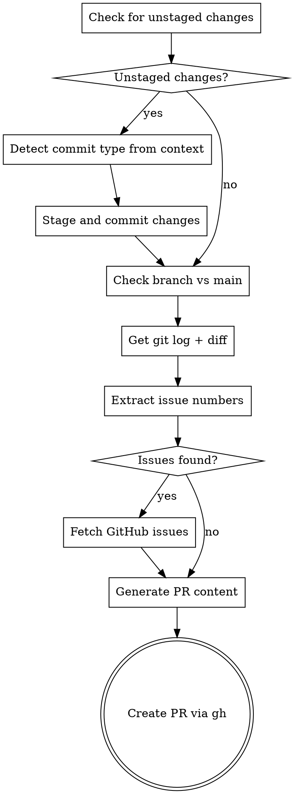

# Design: create-pr Skill

## Overview

A focused skill that streamlines PR creation after completing work. Commits any unstaged changes, gathers context from git history, links related issues, and generates a structured PR with deployment checklist.

## Trigger

**Slash commands:**
- `/create-pr` or `/pr`

**Auto-suggest conditions:**
- Tests just passed (all green)
- Tests were just created and pass
- User says "create PR", "make a PR", "open a PR"

## Workflow



## Auto-Commit: Conventional Commits

**Type detection from context:**

| Context | Type |
|---------|------|
| New test files created | `test:` |
| Test files modified | `test:` |
| New feature files | `feat:` |
| Bug fix pattern (fix, correct, resolve) | `fix:` |
| Refactoring (no behavior change) | `refactor:` |
| Documentation changes | `docs:` |
| Config/build changes | `chore:` |
| Default (unclear) | `feat:` |

**Commit message format:**
```
<type>: <short description from changes>

[optional body with bullet points if multiple files]

Fixes #<issue> (if issue number detected)
```

## Issue Detection

Sources for issue numbers:
1. **Branch name** - `feat/123-add-login`, `fix/456-sql-injection`
2. **Commit messages** - "Fixes #123", "Closes #456", "#789: description"

## PR Template Structure

```markdown
## Summary
<1-2 sentence description from git log analysis>

## Changes
- <change 1 from diff>
- <change 2 from diff>
- ...

## Tests
- <test file 1>: <what it tests>
- <test file 2>: <what it tests>

<If linked issues>
Fixes #<issue-number>
</If>

## Test Plan
- [ ] Run tests: <test command>
- [ ] Verify <key behavior>

## Production Deployment
- [ ] Run migrations (if new migration files detected)
- [ ] Update env vars
- [ ] Update prompts (if applicable)
```

## File Structure

```
create-pr/
├── .claude-plugin/
│   └── plugin.json
└── skills/
    └── create-pr/
        └── SKILL.md
```

## plugin.json

```json
{
  "name": "create-pr",
  "version": "1.0.0",
  "description": "Post-task PR creation with git context analysis and issue linking",
  "author": { "name": "Satria Chandra" },
  "category": "productivity",
  "tags": ["pr", "github", "workflow"]
}
```

## Error Handling

| Scenario | Action |
|----------|--------|
| Unstaged changes exist | Auto-commit with detected type |
| No commits ahead of main | Warn user, suggest committing first |
| Branch doesn't track remote | Push with `-u origin <branch>` |
| Issue fetch fails | Continue without issue details, note warning |
| PR already exists | Open existing PR URL |
