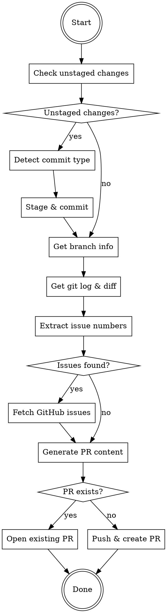

# create-pr Skill Implementation Plan

> **For Claude:** REQUIRED SUB-SKILL: Use superpowers:executing-plans to implement this plan task-by-task.

**Goal:** Create a post-task PR creation skill that auto-commits unstaged changes, gathers git context, links GitHub issues, and generates structured PRs with deployment checklists.

**Architecture:** Single skill file with git-based context gathering, conventional commit type detection, GitHub issue fetching via `gh` CLI, and structured PR template generation.

**Tech Stack:** Git, GitHub CLI (`gh`), Markdown

---

## Task 1: Create Plugin Directory Structure

**Files:**
- Create: `create-pr/.claude-plugin/plugin.json`
- Create: `create-pr/skills/create-pr/SKILL.md`

**Step 1: Create directory structure**

```bash
mkdir -p create-pr/.claude-plugin
mkdir -p create-pr/skills/create-pr
```

**Step 2: Create plugin.json**

Create file `create-pr/.claude-plugin/plugin.json`:

```json
{
  "name": "create-pr",
  "version": "1.0.0",
  "description": "Post-task PR creation with git context analysis and issue linking",
  "author": {
    "name": "Satria Chandra"
  },
  "category": "productivity",
  "tags": ["pr", "github", "workflow", "automation"]
}
```

**Step 3: Verify structure**

Run: `ls -la create-pr/ && ls -la create-pr/.claude-plugin/ && ls -la create-pr/skills/create-pr/`
Expected: All directories and plugin.json exist

**Step 4: Commit**

```bash
git add create-pr/.claude-plugin/plugin.json
git commit -m "feat(create-pr): add plugin metadata"
```

---

## Task 2: Create SKILL.md - Frontmatter and Overview

**Files:**
- Create: `create-pr/skills/create-pr/SKILL.md`

**Step 1: Create SKILL.md with frontmatter and overview**

Create file `create-pr/skills/create-pr/SKILL.md`:

```markdown
---
name: create-pr
description: Use when completing work and ready to create PR, after tests pass, or when user says "create PR", "make a PR", "/pr", or "/create-pr". Auto-commits unstaged changes, gathers git context, links issues, generates structured PR.
version: 1.0.0
---

# Create PR Skill

Post-task PR creation with smart context gathering, auto-commit, and issue linking.

## Core Principle

Streamline PR creation after completing work by automatically committing changes, analyzing git history, linking related issues, and generating a well-structured PR with deployment checklist.

## Trigger

Activate this skill when:
- User says "create PR", "make a PR", "open a PR", "create a pull request"
- User uses `/pr` or `/create-pr` command
- Tests just passed (all green)
- Tests were just created and pass
- User indicates work is complete and ready for PR

---
```

**Step 2: Verify file created**

Run: `head -20 create-pr/skills/create-pr/SKILL.md`
Expected: Frontmatter and overview section visible

**Step 3: Commit**

```bash
git add create-pr/skills/create-pr/SKILL.md
git commit -m "feat(create-pr): add skill frontmatter and overview"
```

---

## Task 3: Add Auto-Commit Section to SKILL.md

**Files:**
- Modify: `create-pr/skills/create-pr/SKILL.md`

**Step 1: Add auto-commit section**

Append to `create-pr/skills/create-pr/SKILL.md`:

```markdown
## Pre-Flight: Auto-Commit Unstaged Changes

Before creating PR, check for and commit any unstaged changes.

### Check for Unstaged Changes

```bash
git status --porcelain
```

If output is not empty, proceed with auto-commit.

### Detect Commit Type from Context

| Context | Type |
|---------|------|
| New test files (*.test.*, *.spec.*) | `test:` |
| Modified test files | `test:` |
| New feature files (src/) | `feat:` |
| Bug fix keywords (fix, correct, resolve, patch) | `fix:` |
| Refactoring (no behavior change) | `refactor:` |
| Documentation (*.md, docs/) | `docs:` |
| Config/build (*.json, *.yaml, Dockerfile) | `chore:` |
| Default (unclear) | `feat:` |

### Generate Commit Message

**Format:**
```
<type>: <short description>

[optional bullet points for multiple files]

Fixes #<issue> (if issue number detected in branch/commits)
```

**Example:**
```
feat: add user authentication flow

- Add login form component
- Add auth service
- Add session management

Fixes #123
```

### Stage and Commit

```bash
# Stage all changes
git add .

# Commit with generated message
git commit -m "<type>: <description>

<body if needed>

Fixes #<issue>"
```

---
```

**Step 2: Verify section added**

Run: `grep -A 5 "Auto-Commit" create-pr/skills/create-pr/SKILL.md`
Expected: Auto-commit section visible

**Step 3: Commit**

```bash
git add create-pr/skills/create-pr/SKILL.md
git commit -m "feat(create-pr): add auto-commit section"
```

---

## Task 4: Add Context Gathering Section to SKILL.md

**Files:**
- Modify: `create-pr/skills/create-pr/SKILL.md`

**Step 1: Add context gathering section**

Append to `create-pr/skills/create-pr/SKILL.md`:

```markdown
## Context Gathering

### Get Current Branch

```bash
git branch --show-current
```

### Get Main Branch

```bash
git remote show origin | grep "HEAD branch" | sed 's/.*: //'
# Or default to 'main' or 'master'
```

### Get Commits Ahead of Main

```bash
git log main..HEAD --oneline
# Or: git log origin/main..HEAD --oneline
```

### Get Diff Summary

```bash
git diff main...HEAD --stat
```

### Get Detailed Changes

```bash
git diff main...HEAD
```

### Analyze for Summary

Extract:
- What files changed
- What functionality was added/modified
- Key patterns (new feature, bug fix, refactor)

---
```

**Step 2: Verify section added**

Run: `grep -A 5 "Context Gathering" create-pr/skills/create-pr/SKILL.md`
Expected: Context gathering section visible

**Step 3: Commit**

```bash
git add create-pr/skills/create-pr/SKILL.md
git commit -m "feat(create-pr): add context gathering section"
```

---

## Task 5: Add Issue Detection Section to SKILL.md

**Files:**
- Modify: `create-pr/skills/create-pr/SKILL.md`

**Step 1: Add issue detection section**

Append to `create-pr/skills/create-pr/SKILL.md`:

```markdown
## Issue Detection

Extract issue numbers from branch names and commits.

### From Branch Name

Patterns to match:
- `feat/123-description` → Issue #123
- `fix/456-description` → Issue #456
- `feature/789-description` → Issue #789
- `bugfix/101-description` → Issue #101

**Command:**
```bash
git branch --show-current | grep -oE '[0-9]+' | head -1
```

### From Commit Messages

Patterns to match:
- `Fixes #123`
- `Closes #456`
- `#789: description`
- `issue #101`

**Command:**
```bash
git log main..HEAD --format="%s %b" | grep -oE '#[0-9]+' | sort -u
```

### Fetch Issue Details

For each detected issue:

```bash
gh issue view 123 --json number,title,body,labels
```

Extract:
- Title: For PR context
- Body: For understanding requirements
- Labels: For PR categorization

---
```

**Step 2: Verify section added**

Run: `grep -A 5 "Issue Detection" create-pr/skills/create-pr/SKILL.md`
Expected: Issue detection section visible

**Step 3: Commit**

```bash
git add create-pr/skills/create-pr/SKILL.md
git commit -m "feat(create-pr): add issue detection section"
```

---

## Task 6: Add PR Template Section to SKILL.md

**Files:**
- Modify: `create-pr/skills/create-pr/SKILL.md`

**Step 1: Add PR template section**

Append to `create-pr/skills/create-pr/SKILL.md`:

```markdown
## PR Template

### Generate PR Title

**From branch prefix:**
- `feat/*` → Feature title
- `fix/*` → Fix title
- `refactor/*` → Refactor title

**From issue (if linked):**
```
[<type>] <issue-title>
```

**Examples:**
- `[FEAT] Add user authentication flow`
- `[FIX] Prevent SQL injection in login`
- `[REFACTOR] Simplify session management`

### PR Body Structure

```markdown
## Summary

<1-2 sentence description from git log analysis>

## Changes

- <change 1 from diff analysis>
- <change 2 from diff analysis>
- <change 3 from diff analysis>

## Tests

- `<test file 1>`: <what it tests>
- `<test file 2>`: <what it tests>

<If linked issues>
Fixes #<issue-number>
</If>

## Test Plan

- [ ] Run tests: `<test command detected or npm test>`
- [ ] Verify <key behavior from changes>

## Production Deployment

- [ ] Run migrations (if new migration files detected)
- [ ] Update env vars
- [ ] Update prompts (if applicable)
```

### Migration Detection

Check for migration files:

```bash
git diff main...HEAD --name-only | grep -i migration
```

If matches found, include migration step in deployment checklist.

---
```

**Step 2: Verify section added**

Run: `grep -A 5 "PR Template" create-pr/skills/create-pr/SKILL.md`
Expected: PR template section visible

**Step 3: Commit**

```bash
git add create-pr/skills/create-pr/SKILL.md
git commit -m "feat(create-pr): add PR template section"
```

---

## Task 7: Add PR Creation Commands Section to SKILL.md

**Files:**
- Modify: `create-pr/skills/create-pr/SKILL.md`

**Step 1: Add PR creation commands section**

Append to `create-pr/skills/create-pr/SKILL.md`:

```markdown
## Create PR

### Push Branch (if needed)

```bash
# Check if branch tracks remote
git rev-parse --abbrev-ref --symbolic-full-name @{u}

# If no upstream, push with -u
git push -u origin <branch-name>
```

### Create PR via gh CLI

```bash
gh pr create \
  --title "<PR title>" \
  --body "$(cat <<'EOF'
<PR body content>
EOF
)"
```

### Alternative: Open PR Page

If user prefers to review before creating:

```bash
gh pr create --web
```

---
```

**Step 2: Verify section added**

Run: `grep -A 5 "Create PR" create-pr/skills/create-pr/SKILL.md`
Expected: Create PR section visible

**Step 3: Commit**

```bash
git add create-pr/skills/create-pr/SKILL.md
git commit -m "feat(create-pr): add PR creation commands section"
```

---

## Task 8: Add Error Handling Section to SKILL.md

**Files:**
- Modify: `create-pr/skills/create-pr/SKILL.md`

**Step 1: Add error handling section**

Append to `create-pr/skills/create-pr/SKILL.md`:

```markdown
## Error Handling

| Scenario | Action |
|----------|--------|
| No commits ahead of main | Warn: "No changes to create PR. Commit your changes first." |
| Branch doesn't track remote | Push with `-u origin <branch>` |
| Issue fetch fails | Continue without issue details, warn in output |
| PR already exists | Open existing PR: `gh pr view <number> --web` |
| `gh` not authenticated | Guide user: `gh auth login` |
| No write access to repo | Suggest fork workflow |

### Check for Existing PR

```bash
gh pr list --head <branch-name> --json number,url
```

If PR exists, show URL instead of creating duplicate.

---
```

**Step 2: Verify section added**

Run: `grep -A 5 "Error Handling" create-pr/skills/create-pr/SKILL.md`
Expected: Error handling section visible

**Step 3: Commit**

```bash
git add create-pr/skills/create-pr/SKILL.md
git commit -m "feat(create-pr): add error handling section"
```

---

## Task 9: Add Workflow Diagram to SKILL.md

**Files:**
- Modify: `create-pr/skills/create-pr/SKILL.md`

**Step 1: Add workflow diagram section**

Append to `create-pr/skills/create-pr/SKILL.md`:

```markdown
## Complete Workflow



---
```

**Step 2: Verify section added**

Run: `grep -A 5 "Complete Workflow" create-pr/skills/create-pr/SKILL.md`
Expected: Complete workflow section visible

**Step 3: Commit**

```bash
git add create-pr/skills/create-pr/SKILL.md
git commit -m "feat(create-pr): add workflow diagram"
```

---

## Task 10: Add Example Interaction to SKILL.md

**Files:**
- Modify: `create-pr/skills/create-pr/SKILL.md`

**Step 1: Add example interaction section**

Append to `create-pr/skills/create-pr/SKILL.md`:

```markdown
## Example Interaction

**User:** `/pr`

**Create-PR:**
```
🚀 Creating PR...

📝 Checking for unstaged changes...
   Found 2 unstaged files
   Detected type: feat (new feature files)
   Committing: "feat: add user profile component"
   ✓ Committed

📊 Gathering context...
   Branch: feat/142-add-user-profile
   Commits: 3 ahead of main
   Files changed: 5

🔗 Detecting linked issues...
   Found #142 in branch name
   Fetching issue details... ✓

📝 Generating PR content...

🚀 Creating PR...
   ✓ PR #15 created: https://github.com/owner/repo/pull/15

✅ Done!
   - Auto-committed 2 files
   - Linked issue #142
   - PR created with deployment checklist
```

---

## Notes

- **Conventional commits** - Auto-detect type from changed files
- **Smart issue linking** - Extract from branch name and commit messages
- **Migration detection** - Auto-add migration step if migration files changed
- **Graceful failures** - Continue without issues if fetch fails
- **No duplicates** - Check for existing PR before creating
```

**Step 2: Verify section added**

Run: `grep -A 5 "Example Interaction" create-pr/skills/create-pr/SKILL.md`
Expected: Example interaction section visible

**Step 3: Commit**

```bash
git add create-pr/skills/create-pr/SKILL.md
git commit -m "feat(create-pr): add example interaction"
```

---

## Task 11: Update marketplace.json

**Files:**
- Modify: `.claude-plugin/marketplace.json`

**Step 1: Add create-pr plugin to marketplace**

Add to the `plugins` array in `.claude-plugin/marketplace.json`:

```json
    {
      "name": "create-pr",
      "source": "./create-pr",
      "description": "Post-task PR creation with git context analysis, auto-commit, and issue linking",
      "version": "1.0.0",
      "author": {
        "name": "Satria Chandra"
      },
      "category": "productivity",
      "tags": ["pr", "github", "workflow", "automation"]
    }
```

**Step 2: Verify marketplace.json is valid JSON**

Run: `cat .claude-plugin/marketplace.json | python3 -m json.tool`
Expected: Valid JSON output

**Step 3: Commit**

```bash
git add .claude-plugin/marketplace.json
git commit -m "feat(marketplace): add create-pr plugin to marketplace"
```

---

## Task 12: Final Verification

**Step 1: Verify skill file is complete**

Run: `wc -l create-pr/skills/create-pr/SKILL.md`
Expected: 200+ lines

**Step 2: Verify all sections present**

Run: `grep "^##" create-pr/skills/create-pr/SKILL.md`
Expected:
- Core Principle
- Trigger
- Pre-Flight: Auto-Commit Unstaged Changes
- Context Gathering
- Issue Detection
- PR Template
- Create PR
- Error Handling
- Complete Workflow
- Example Interaction
- Notes

**Step 3: Verify plugin structure**

Run: `tree create-pr/`
Expected:
```
create-pr/
├── .claude-plugin/
│   └── plugin.json
└── skills/
    └── create-pr/
        └── SKILL.md
```

**Step 4: Final commit (if any uncommitted)**

```bash
git status
git add -A
git commit -m "feat(create-pr): complete skill implementation"
```
