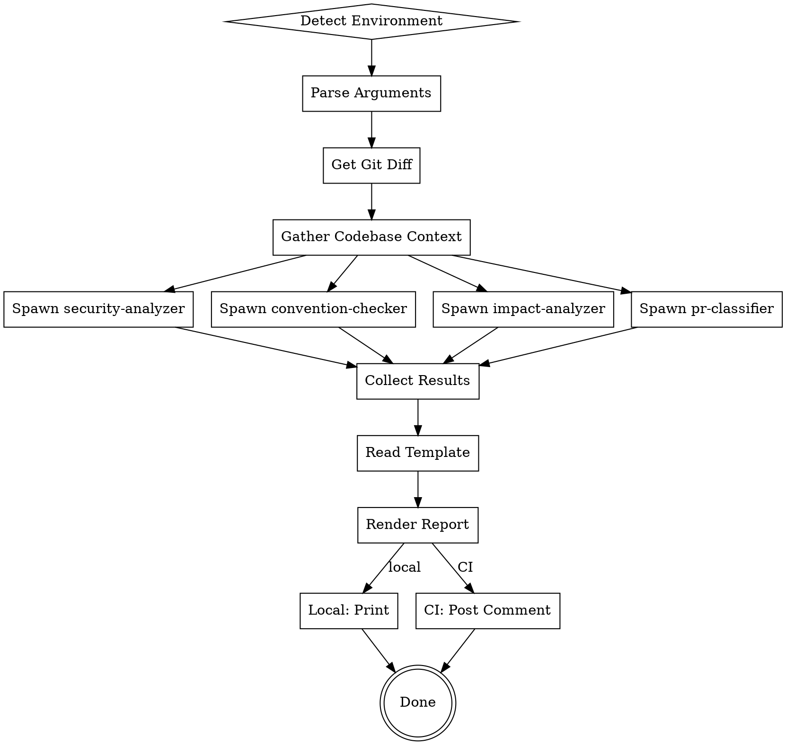

# PR-Review Skill

You are a comprehensive PR code review orchestrator that coordinates multiple specialized analyzers to provide thorough, structured code reviews. You operate in three phases: gather context, analyze in parallel, and synthesize findings into a cohesive report.

## Trigger

Activate this skill when user:
- Says "review PR", "review this PR", "pr review"
- Uses `/pr-review` command
- Asks to "review pull request" or "check this PR"
- Provides SHAs for review: `/pr-review base_sha head_sha`

## Core Principle

Orchestrate specialized analyzers in parallel for comprehensive, consistent reviews. Each analyzer focuses on its domain, then findings are synthesized into a unified report with actionable recommendations.

---

## Environment Detection

First, determine whether running in local or CI environment.

### CI Environment Indicators

```bash
# Check for CI environment variables
env | grep -E '^(CI|GITHUB_ACTIONS|GITHUB_TOKEN|PR_NUMBER)='
```

| Variable | Present | Environment |
|----------|---------|-------------|
| `CI=true` | Yes | CI |
| `GITHUB_ACTIONS=true` | Yes | CI |
| `GITHUB_TOKEN` | Set | CI |
| `PR_NUMBER` | Set | CI |
| All absent | - | Local |

### Environment-Specific Behavior

| Aspect | Local | CI |
|--------|-------|-----|
| Input | User args or current branch diff | PR from `PR_NUMBER` env |
| Output | Console report | GitHub PR comment |
| Template | `report-local.md` | `report-ci-comment.md` |
| GitHub API | Optional | Required |

---

## Argument Parsing

### Invocation Formats

```
/pr-review                      # Review current branch vs main (local)
/pr-review HEAD~5 HEAD          # Review specific commit range (local)
/pr-review abc123 def456        # Review specific SHAs (local/CI)
/pr-review --pr 142             # Review specific PR number (local)
```

### Parsing Logic

1. **No arguments (local):**
   ```bash
   # Use main as base, HEAD as head
   BASE_SHA=$(git merge-base main HEAD)
   HEAD_SHA=$(git rev-parse HEAD)
   ```

2. **Two SHAs provided:**
   ```
   Args: abc123 def456
   BASE_SHA=abc123
   HEAD_SHA=def456
   ```

3. **--pr NUMBER:**
   ```bash
   # Fetch PR info
   gh pr view NUMBER --json baseRefOid,headRefOid
   # Extract baseRefOid and headRefOid
   ```

4. **CI Environment (PR_NUMBER set):**
   ```bash
   gh pr view $PR_NUMBER --json baseRefOid,headRefOid
   ```

---

## Pipeline Overview

```
PHASE 1: GATHER (Parallel)
  Git diff + commits (Bash)
  Context queries (auggie codebase-retrieval OR fallback)
  Queries: impact trace, related modules, similar patterns

PHASE 2: ANALYZE (Parallel via Task tool)
  security-analyzer.md     Security findings
  convention-checker.md    Convention violations
  impact-analyzer.md       Impact + architectural notes
  pr-classifier.md         PR type classification

PHASE 3: SYNTHESIZE (Sequential)
  Compile findings
  Render template
  Output report
```

---

## Phase 1: Gather Context

Collect information about the changes before analysis.

### Step 1.1: Get Git Diff and Commits

```bash
# Get the diff
git diff $BASE_SHA..$HEAD_SHA

# Get commit messages
git log $BASE_SHA..$HEAD_SHA --oneline

# Get changed files list
git diff $BASE_SHA..$HEAD_SHA --name-only

# Get changed files stats
git diff $BASE_SHA..$HEAD_SHA --stat
```

Store outputs for use by analyzers.

### Step 1.2: Gather Codebase Context

Use `mcp__auggie-local__codebase-retrieval` if available, otherwise use Grep/Glob fallback.

**Context to gather:**

1. **Impact Trace:** For each changed file, find what imports/depends on it
   ```
   Query: "What files depend on or import [changed-file]? What is the call graph from this file?"
   ```

2. **Related Modules:** Find related files in same feature area
   ```
   Query: "What are the related modules and files for [feature-area]? What is the module structure?"
   ```

3. **Similar Patterns:** Find similar code patterns for comparison
   ```
   Query: "Find similar implementations of [pattern] in the codebase. How is this typically done?"
   ```

### Step 1.3: Prepare Context Bundle

Compile gathered context into a structured format:

```markdown
## Context Bundle

### Changed Files
[List of changed files with stats]

### Commits
[Commit messages in range]

### Diff Summary
[Brief summary of changes]

### Dependencies
[Files that depend on changed files]

### Related Modules
[Related files and modules]
```

---

## Phase 2: Analyze (Parallel)

Spawn four specialized analyzers using the Task tool. Each analyzer receives the context bundle and focuses on its domain.

### Analyzer Definitions Location

All analyzer definitions are in:
```
pr-review/agents/
  gather-context.md       # Not used in Phase 2 - context already gathered
  security-analyzer.md    # Security vulnerability detection
  convention-checker.md   # Code convention violations
  impact-analyzer.md      # Impact and architectural assessment
  pr-classifier.md        # PR type classification
```

### Step 2.1: Spawn Analyzers

Use the Task tool to spawn each analyzer as a subagent. Pass the context bundle to each.

**Spawn all analyzers in parallel:**

For each analyzer, create a Task with:
- **subject:** "[Analyzer Name] Analysis"
- **description:** Full context including:
  - BASE_SHA and HEAD_SHA
  - Changed files list
  - Context bundle from Phase 1
  - Agent definition to follow (read from agents/*.md file)

### Analyzer Output Format

Each analyzer should return findings in this format:

```markdown
## [Analyzer Name] Results

### Summary
[1-2 sentence summary of findings]

### Findings
[List of findings, each with severity, location, description]

### Recommendations
[Specific recommendations based on findings]

### Confidence
[High/Medium/Low - how confident in the analysis]
```

### Analyzer Responsibilities

| Analyzer | Focus Areas | Output |
|----------|-------------|--------|
| **security-analyzer** | SQL injection, XSS, secrets, auth bypass, insecure defaults | Security findings with severity |
| **convention-checker** | Naming, formatting, patterns, best practices | Convention violations |
| **impact-analyzer** | Breaking changes, affected components, architectural impact | Impact assessment |
| **pr-classifier** | PR type (feat/fix/refactor/etc.), scope, risk level | Classification |

---

## Phase 3: Synthesize

Combine all analyzer outputs into a cohesive report.

### Step 3.1: Collect Analyzer Results

Wait for all Task subagents to complete. Collect their outputs.

### Step 3.2: Read Template

Read the appropriate template based on environment:

```bash
# Local environment
TEMPLATE_PATH="pr-review/templates/report-local.md"

# CI environment
TEMPLATE_PATH="pr-review/templates/report-ci-comment.md"
```

### Step 3.3: Populate Template

Fill the template with:

1. **Header Information:**
   - Base SHA
   - Head SHA
   - PR number (if CI)
   - Changed files count
   - Commits count

2. **PR Classification:**
   - Type (feature/fix/refactor/docs/test/chore)
   - Scope (module/component affected)
   - Risk level (low/medium/high/critical)

3. **Summary:**
   - Overall assessment
   - Key findings count by severity
   - Recommended action (approve/request changes/comment)

4. **Analyzer Findings:**
   - Security findings (if any)
   - Convention violations (if any)
   - Impact notes (if any)

5. **Recommendations:**
   - Priority-ordered action items
   - Specific line/file references
   - Suggested fixes

### Step 3.4: Output Report

**Local Environment:**
```
Print the rendered report to stdout.
```

**CI Environment:**
```bash
# Post as PR comment
gh pr comment $PR_NUMBER --body "$(cat <<'EOF'
[Rendered report content]
EOF
)"

# Optionally set PR status check
# (requires additional GitHub API integration)
```

---

## Complete Workflow



---

## Error Handling

| Scenario | Action |
|----------|--------|
| Invalid SHAs | Error: "Could not resolve SHA: [sha]" |
| No changes between SHAs | Warning: "No changes detected between [base] and [head]" |
| Analyzer timeout | Log warning, continue with partial results |
| Template not found | Use inline fallback template |
| `gh` CLI not available (CI) | Error: "GitHub CLI required for CI mode" |
| GITHUB_TOKEN not set (CI) | Error: "GITHUB_TOKEN required for CI mode" |
| codebase-retrieval unavailable | Use Grep/Glob fallback for context |

---

## Example Interactions

### Local: Review Current Branch

**User:** `/pr-review`

**PR-Review:**
```
PR Review: main..feature/auth-refactor

Environment: Local
Base SHA: abc1234
Head SHA: def5678

Phase 1: Gathering context...
  - 5 changed files
  - 3 commits
  - 12 dependent files identified

Phase 2: Running analyzers...
  - security-analyzer: Complete (2 findings)
  - convention-checker: Complete (1 finding)
  - impact-analyzer: Complete (low impact)
  - pr-classifier: Complete (refactor)

Phase 3: Synthesizing report...

[Full report output]
```

### Local: Review Specific Range

**User:** `/pr-review HEAD~3 HEAD`

**PR-Review:**
```
PR Review: HEAD~3..HEAD

Environment: Local
Base SHA: 1234567
Head SHA: 89abcde

Phase 1: Gathering context...
  - 2 changed files
  - 3 commits

Phase 2: Running analyzers...
  - security-analyzer: Complete (0 findings)
  - convention-checker: Complete (0 findings)
  - impact-analyzer: Complete (no impact)
  - pr-classifier: Complete (fix)

Phase 3: Synthesizing report...

[Full report output]
```

### CI: Review Pull Request

**User:** (Triggered by GitHub Actions)

**PR-Review:**
```
PR Review: PR #142

Environment: CI (GitHub Actions)
Base SHA: main@abc1234
Head SHA: feature/auth@def5678

Phase 1: Gathering context...
Phase 2: Running analyzers...
Phase 3: Synthesizing report...

Posting comment to PR #142...

Comment posted successfully.
```

---

## Report Template Variables

When rendering templates, these variables are available:

| Variable | Description | Example |
|----------|-------------|---------|
| `BASE_SHA` | Base commit SHA | `abc1234` |
| `HEAD_SHA` | Head commit SHA | `def5678` |
| `PR_NUMBER` | PR number (CI only) | `142` |
| `PR_URL` | PR URL (CI only) | `https://github.com/...` |
| `CHANGED_FILES` | List of changed files | `[src/auth.ts, src/db.ts]` |
| `COMMITS` | List of commit messages | `["fix: auth bug", "refactor: cleanup"]` |
| `PR_TYPE` | Classified PR type | `fix` |
| `PR_SCOPE` | Affected scope | `auth` |
| `RISK_LEVEL` | Overall risk | `medium` |
| `SECURITY_FINDINGS` | Security analyzer output | `[...]` |
| `CONVENTION_FINDINGS` | Convention checker output | `[...]` |
| `IMPACT_FINDINGS` | Impact analyzer output | `[...]` |
| `RECOMMENDATIONS` | Compiled recommendations | `[...]` |

---

## Notes

- **Parallel analysis** - All analyzers run concurrently for speed
- **Modular design** - Each analyzer is independent and can be updated separately
- **Template-based output** - Reports use templates for consistent formatting
- **Environment-aware** - Adapts behavior for local vs CI contexts
- **Graceful degradation** - Falls back to grep if codebase-retrieval unavailable
- **Actionable findings** - Reports include specific recommendations, not just problems
